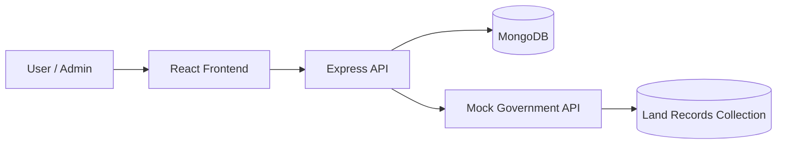

# Bhumi-Setu

Bhumi-Setu is a land acquisition and project monitoring platform designed to streamline the workflow for government and project teams handling land records, verification, compensation assessment, and statutory milestones. It is a prototype developed by Team GeoGrid for SIH Internal – Brainware University under Problem Statement No-SIH26016.

The application brings together a React-based dashboard, Express/Node API, and MongoDB-backed data model to help users:

- register and authenticate users securely
- verify parcel records against mock government datasets
- create acquisition projects linked to parcel IDs
- track statutory milestones and acquisition progress
- estimate compensation using land area, market value, and multiplier logic
- review verified land documents and project status
- monitor the overall portfolio from a single dashboard

---

## Project Overview

Bhumi-Setu acts as a digital decision-support system for land acquisition workflows. It is tailored for the modern land acquisition lifecycle where a project must be validated, documented, compensated, and tracked through compliance checkpoints.

The application simulates a realistic public-sector workflow:

1. A user registers or logs in.
2. A parcel is verified against a government land database.
3. A project is created and linked to the verified parcel.
4. The system calculates and tracks statutory acquisition stages.
5. The user reviews and verifies supporting documents.
6. Compensation is calculated and landowner payments are marked as paid.
7. The dashboard updates project health and progress across the full portfolio.

---

## Key Features

### 1. Authentication and Session Control
- Secure user registration and login using bcrypt hashing and JWT tokens
- Protected API routes via middleware authentication
- Logout support with revocation of tokens

### 2. Parcel Verification Workflow
- Users create projects using a parcel ID
- Backend verifies the parcel against a mock government API
- Parcel data includes landowner, district, state, market value, land use, and documents

### 3. Portfolio Dashboard
- Total, completed, and pending project counters
- Acquired vs under-acquisition status breakdown
- State-wise project progress snapshot
- Quick-access cards for active projects

### 4. Statutory Workflow Tracking
- RFCTLARR-style milestone stages
- Stage completion logic based on parcel validation, doc verification, and compensation payment
- Workflow progress calculation and risk flagging

### 5. Compensation Management
- Compensation calculation using:
  - land area
  - market value
  - rural/urban multiplier
  - solatium rate
- Payment status tracking for landowners
- DBT/payment workflow integration points

### 6. Document Management
- Upload UI for land records
- Verified document table with OCR match percentages and status chips
- Document review workflow and action buttons

### 7. GIS and Spatial View
- India map with Leaflet-based visualization
- Markers, layers, zoom, pan, and fullscreen controls
- Spatial representation of project locations

### 8. Decision Support and Alerts
- Smart alerts for pending actions and compliance risk
- AI-style decision support views for workflow prioritization

---

## Tech Stack

### Backend
- Node.js
- Express.js
- MongoDB with Mongoose
- JWT authentication
- bcryptjs password hashing
- dotenv for environment config
- CORS support

### Frontend
- React
- React Router
- Material UI (MUI)
- Leaflet + react-leaflet for GIS maps
- Recharts for charting
- Tailwind CSS (used alongside component styling)

### Data & Simulation
- Mock Government API service for parcel verification
- Seed script for land records generation

---

## System Architecture



The frontend consumes the backend REST APIs. The backend validates the user, connects to MongoDB, and checks land parcel validity through a mock government service. That mock service reads land records from MongoDB to simulate public land verification.

---

## Folder Structure

```text
Bhumi-Setu/
├── README.md
├── Backend/
│   ├── middleware/
│   │   └── auth.js
│   ├── models/
│   │   ├── LandRecord.js
│   │   ├── Project.js
│   │   └── User.js
│   ├── routes/
│   │   ├── auth.js
│   │   └── project.js
│   ├── mockGovApi.js
│   ├── seedLandRecords.js
│   ├── server.js
│   └── package.json
├── Frontend/
│   ├── public/
│   ├── src/
│   │   ├── api/
│   │   ├── components/
│   │   ├── hooks/
│   │   ├── pages/
│   │   ├── App.jsx
│   │   ├── index.js
│   │   └── index.css
│   ├── package.json
│   ├── tailwind.config.js
│   └── postcss.config.js
└── .gitignore
```

---

## Backend Details

### Main Server
File: `Backend/server.js`

Responsibilities:
- Initializes Express and CORS
- Loads environment variables
- Connects to MongoDB
- Mounts auth and project routes
- Exposes health endpoint at `/health`

### Authentication Routes
File: `Backend/routes/auth.js`

Endpoints:
- `POST /api/auth/register`
- `POST /api/auth/login`
- `POST /api/auth/logout`

Behavior:
- Validates username length and password strength
- Hashes passwords with bcrypt
- Issues JWT tokens with expiration of 7 days
- Rejects invalid credentials and revoked sessions

### Project Routes
File: `Backend/routes/project.js`

Endpoints:
- `GET /api/projects`
- `POST /api/projects`
- `POST /api/projects/compensate/:projectId`

Behavior:
- Fetches all projects for the authenticated user
- Creates projects only after verifying parcel IDs through the government API
- Generates a default workflow and compensation structure for each project
- Updates project stages and payment status when compensation is made

### Models
- `User.js`: stores username and hashed password
- `Project.js`: stores project metadata, workflow, compensation and document state
- `LandRecord.js`: stores land parcel records for mock verification

### Mock Government API
File: `Backend/mockGovApi.js`

This service simulates government verification for parcel records:
- `GET /land/:parcelId`
- `GET /verify?parcelId=...`

It reads land records from the `landrecords` collection and returns a verified record if the parcel exists.

---

## Frontend Details

The frontend is a React application built around a project portfolio management dashboard.

### Main Application Flow
- User lands on login/register screen if unauthenticated
- After login, user is redirected to dashboard
- A selected project opens workflow and acquisition details
- The sidebar gives access to current project modules:
  - dashboard
  - projects
  - GIS map
  - statutory workflow
  - compensation calculator
  - documents
  - smart alerts
  - AI decision support

### Feature Modules
- `Dashboard.jsx`: summary cards, project tiles, portfolio health
- `ProjectList.jsx`: list of all tracked projects
- `Workflow.jsx`: milestone and completion tracking
- `CompensationCalc.jsx`: compensation estimate and payment processing
- `Documents.jsx`: file upload and verification table
- `GISMap.jsx`: interactive map view
- `Auth.jsx`: user authentication UI
- `NewProjectDialog.jsx`: create new project from parcel ID

### API Layer
File: `Frontend/src/api/index.js`

The frontend uses a fetch-based API wrapper with:
- session token storage
- automatic login redirect on 401
- reusable request logic for CRUD and auth calls

---

## Database and Seed Data

### MongoDB
The backend expects MongoDB to be running locally by default at:

```text
mongodb://127.0.0.1:27017/bhumi-setu
```

### Seed Script
File: `Backend/seedLandRecords.js`

This generates a seeded dataset of 70 land records into the `landrecords` collection. These records are used by the mock government API to validate parcel IDs.

Command:

```bash
cd Backend
npm run seed:land-records
```

---

## Environment Variables

### Backend (.env in Backend folder)
Create a `.env` file in the `Backend` folder:

```env
PORT=5000
MONGODB_URI=mongodb://127.0.0.1:27017/bhumi-setu
JWT_SECRET=your_super_secret_key
GOVERNMENT_API_URL=http://127.0.0.1:6000
```

### Frontend (.env in Frontend folder)
Create a `.env` file in the `Frontend` folder if needed:

```env
REACT_APP_API_URL=http://localhost:5000/api
```

If this is not set, the app defaults to `/api` and relies on the frontend proxy configuration in `package.json`.

---

## Installation and Run Instructions

### 1. Clone the repository

```bash
git clone <repo-url>
cd Bhumi-Setu
```

### 2. Install backend dependencies

```bash
cd Backend
npm install
```

### 3. Install frontend dependencies

```bash
cd ../Frontend
npm install
```

### 4. Start MongoDB
Ensure MongoDB is running locally before starting the app.

### 5. Seed land records

```bash
cd Backend
npm run seed:land-records
```

### 6. Start the mock government verification service

```bash
cd Backend
node mockGovApi.js
```

This runs on port `6000`.

### 7. Start the backend API

```bash
cd Backend
npm start
```

This runs on port `5000` by default.

### 8. Start the frontend app

```bash
cd Frontend
npm start
```

The React app will start on the default CRA port, usually `3000`.

---

## Typical User Workflow

1. Open the frontend in the browser.
2. Register a new user or login with an existing account.
3. Create a new acquisition project using a valid parcel ID.
4. Verify parcel data from the mock government database.
5. Inspect workflow progress and risk factors.
6. Review and verify project documents.
7. Calculate and finalize landowner compensation.
8. Mark payments as paid and monitor project completion.

---

## API Summary

### Auth
- `POST /api/auth/register`
- `POST /api/auth/login`
- `POST /api/auth/logout`

### Projects
- `GET /api/projects`
- `POST /api/projects`
- `POST /api/projects/compensate/:projectId`

### Health
- `GET /health`

### Mock Government Verification
- `GET /land/:parcelId`
- `GET /verify?parcelId=...`

---

## Notes and Assumptions

- This is a prototype and uses mock verification data rather than a real government API.
- The UI is designed for an internal project management workflow and not a production-grade public portal.
- The project demonstrates a full land acquisition lifecycle with emphasis on phased tracking and compensation logic.
- The backend is intentionally lightweight and focused on the core domain rather than enterprise-scale scaling.

---

## Future Enhancements

Potential improvements for a production-ready version include:

- real GIS parcel integration with geospatial data providers
- OCR and document classification with a true AI pipeline
- role-based access control for officials, surveyors, and admins
- audit history and revision tracking for land records
- notification engine for stage updates and payment reminders
- stronger approval flows and digital signatures
- compliance reporting and analytics dashboards

---

## License

This project is for internal prototype use and is currently distributed under the repository’s existing license terms.

---

## Acknowledgements

This project was developed by Team GeoGrid for the SIH Internal challenge at Brainware University, with the objective of improving the digital workflow for land acquisition and compensation management.
